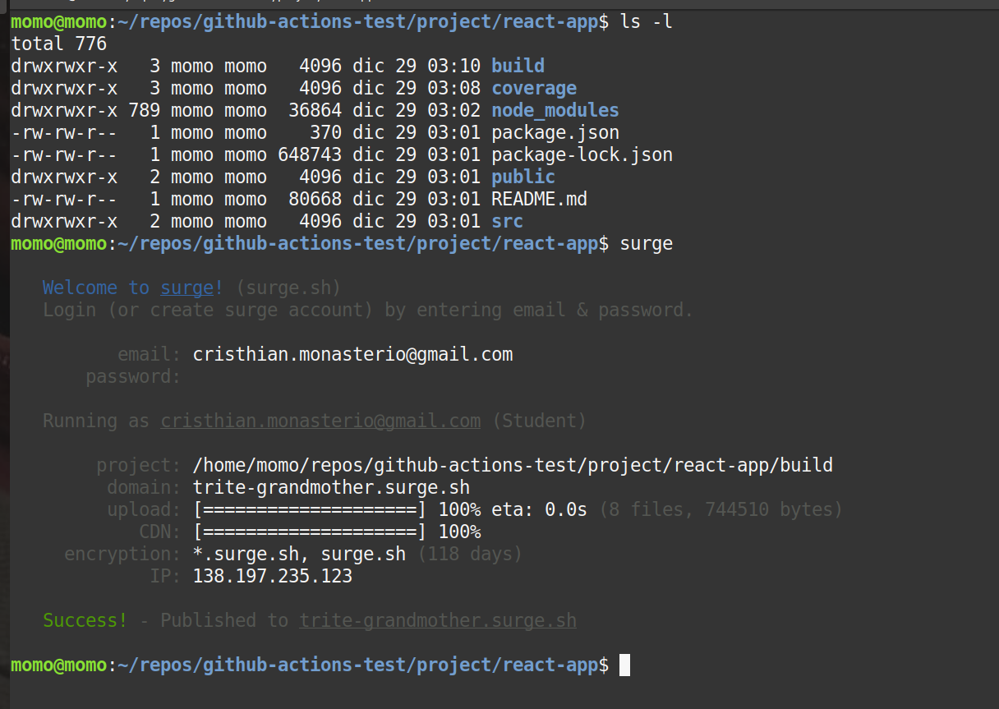
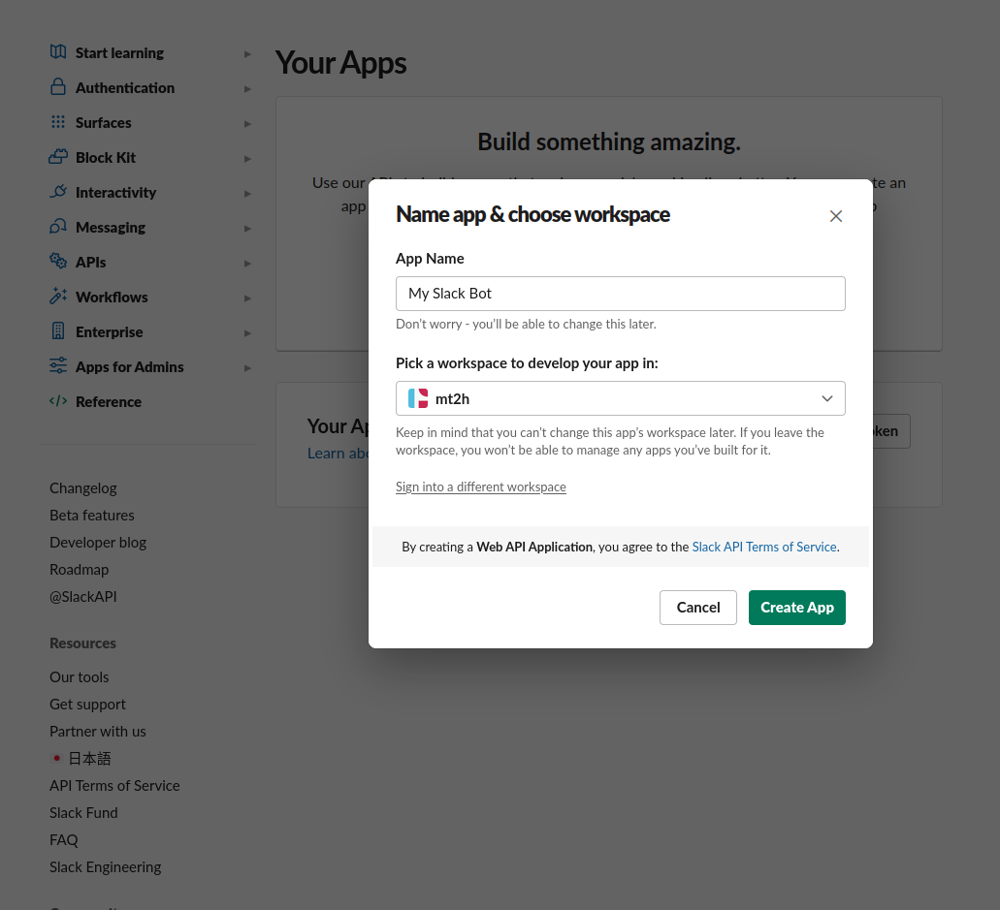
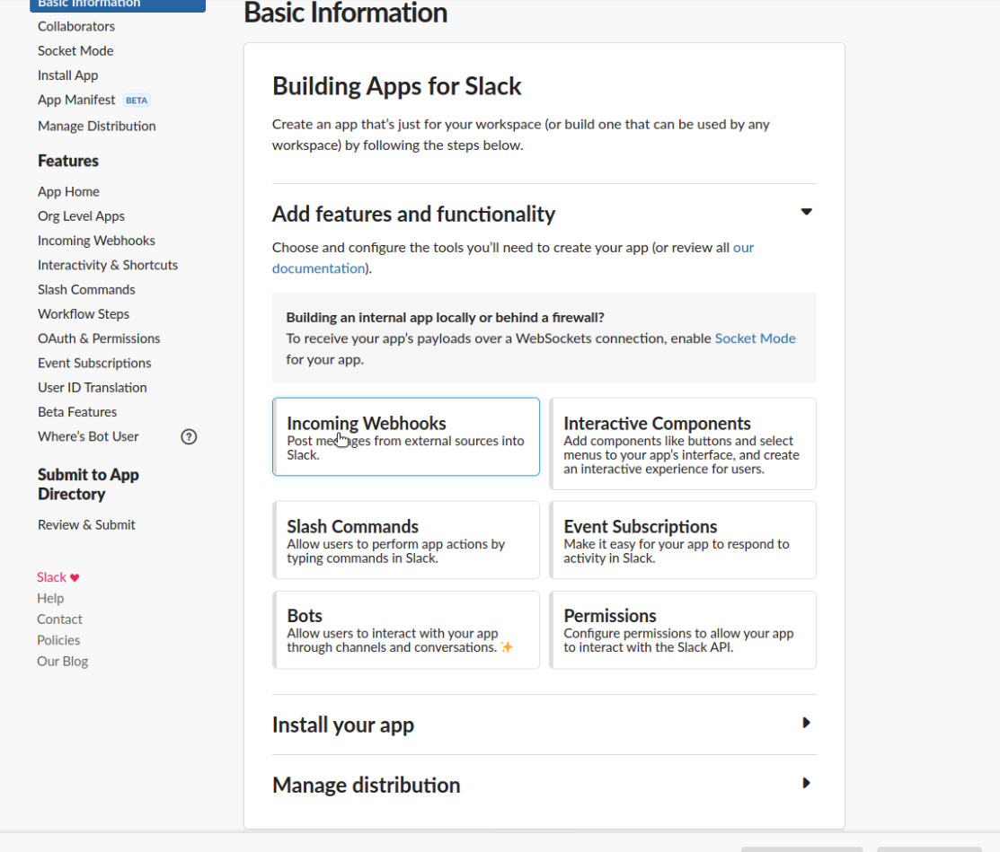
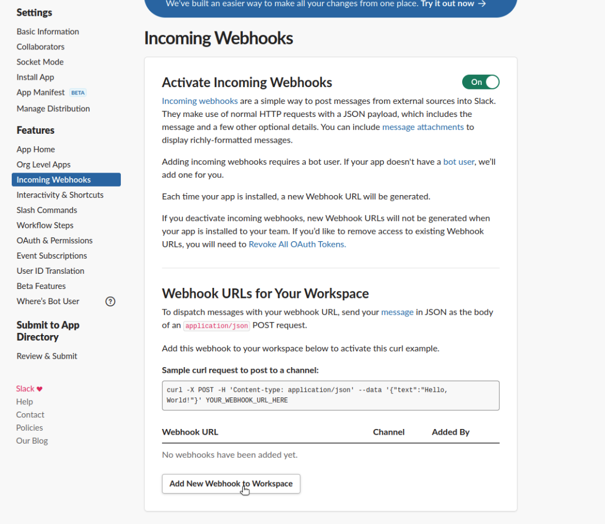
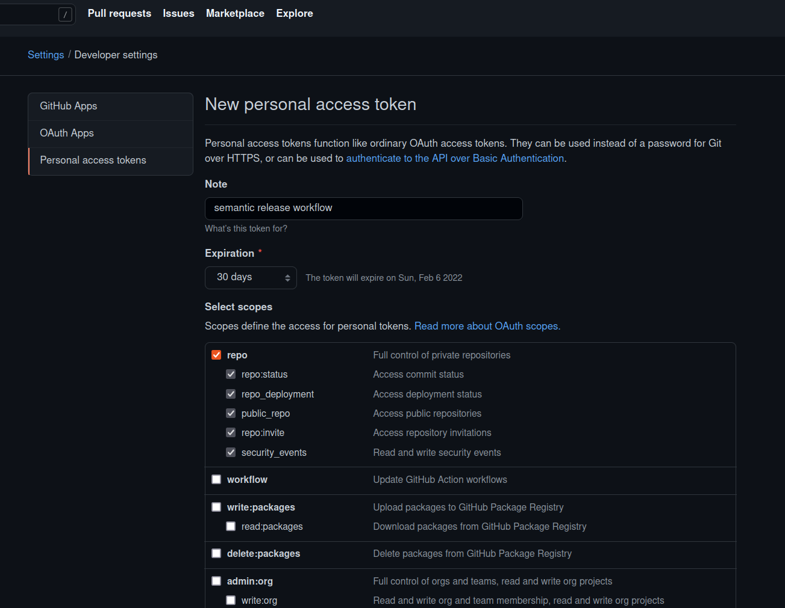
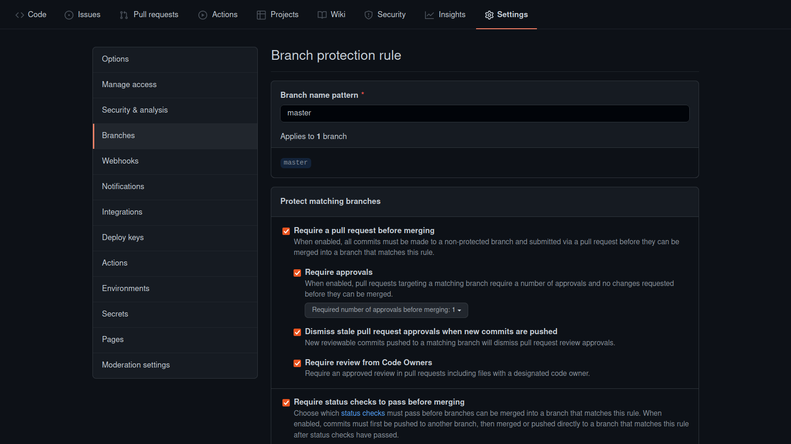
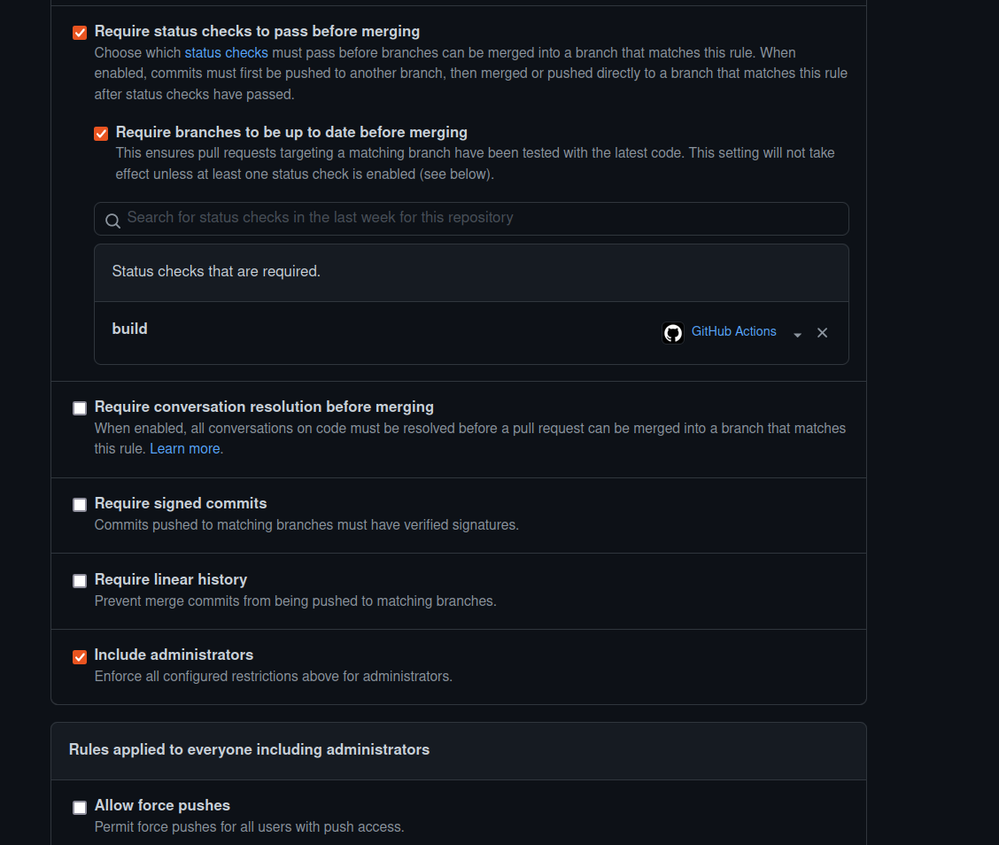

# GitHub Actions

This project is the continuation of https://github.com/mt2h/github-actions-course of course Github Actions

## Local testing react app

```bash
#create react app
cd project/
sudo snap install node --classic
npx create-react-app react-app --use-npm

#local test
cd react-app/
npm run start

npm run test
CI=true #the npm run test doesn't heard changes
npm run test -- --coverage

npm run build

#deploy app on surge
sudo npm install --global surge
surge
#trite-grandmother.surge.sh

#verify
npm install --save-dev --save-exact prettier
npx prettier --check "**/*.js"
npx prettier --write "**/*.js"
npx prettier --check "**/*.js"

npx prettier --write "**/*.{js,jsx.yml,yaml,.json.css,scss,md}"
npm run format:check
```

## Prepare build react app

```bash
#prepared
sudo npm i -g prettier
prettier --check .
prettier --write .

#get data surge
surge token
surge whoami
```

## Semantic

```bash
#npm install --save-dev semantic-release
npm install --save-dev 'semantic-release@^16.0.3'
git commit -m "fix: fix description"
npx semantic-release

#npm install --save-dev @commitlint/config-conventional @commitlint/cli husky
npm install --save-dev '@commitlint/config-conventional@^8.3.4'
npm install --save-dev '@commitlint/cli@^8.3.5'
npm install --save-dev 'husky@^4.2.5'
```

## Personal Actions

```bash
npm install @actions/github --save
npm install @actions/core --save

npm i -D '@zeit/ncc@^0.20.5'
npx ncc build .github/actions/hello/index.js -o .github/actions/hello/dist
```

## Surge



## Slack

https://api.slack.com/apps

create new app








## Token Github Actions



## Branch protected




